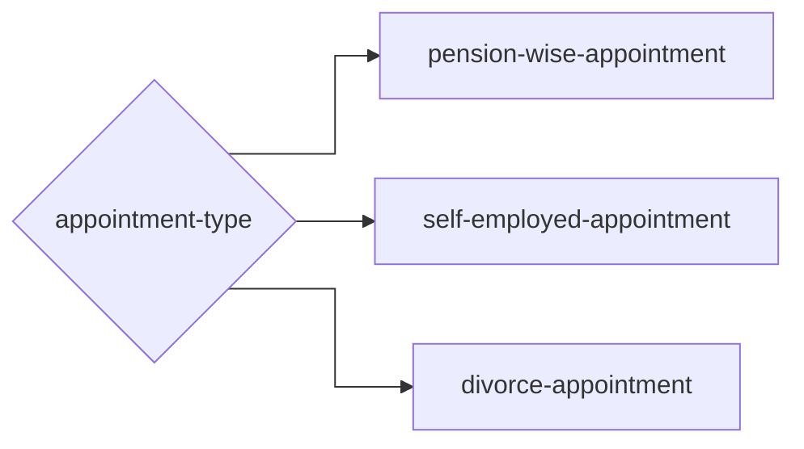
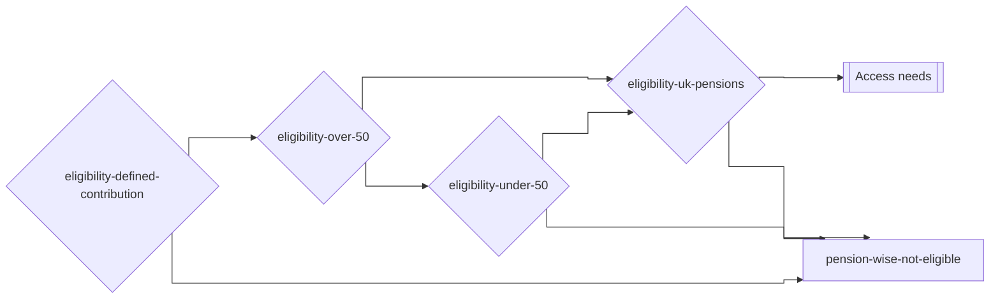
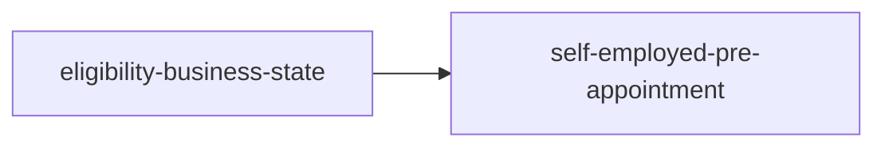
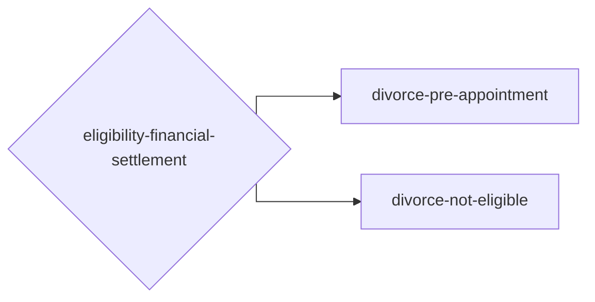

# Booking Forms Routing Diagrams

This page documents the route flow in smaller Mermaid sections so larger journeys stay readable.

Notation used in diagrams: `[step]` = page/step, `{decision}` = branching decision.

Design reference: [Figma - GSI journey map](https://www.figma.com/design/n07aj0G4F2HaaNiyXLggtq/GSI?node-id=1754-52193&p=f&m=dev)

## Table of contents

- [Previewing diagrams](#previewing-diagrams)
- [Source of truth](#source-of-truth)
- [Appointment](#appointment-section)
- [Eligibility](#eligibility-section)
  - [Pension Wise](#pension-wise)
  - [Self-employed](#self-employed)
  - [Divorce](#divorce)

## Previewing diagrams

- GitHub supports Mermaid in Markdown and renders these diagrams.
- Azure DevOps does not consistently render Mermaid in Markdown, so it may show raw code blocks.
- For now, preview diagrams locally in VS Code using Markdown Preview with a Mermaid extension.
- Suggested extension: `MermaidChart.vscode-mermaid-chart` (Mermaid).

## Source of truth

Routing behaviour is defined by these files:

- [routeFlow.ts](../routes/routeFlow.ts)
- [routeConfig.ts](../routes/routeConfig.ts)

## Appointment Section

This section shows how users branch from `appointment-type` into the three booking journeys.

## Eligibility Section

This section shows the eligibility logic used after appointment selection, including pass/fail outcomes for each route.

### Pension Wise

---

### Self-employed

---

### Divorce

