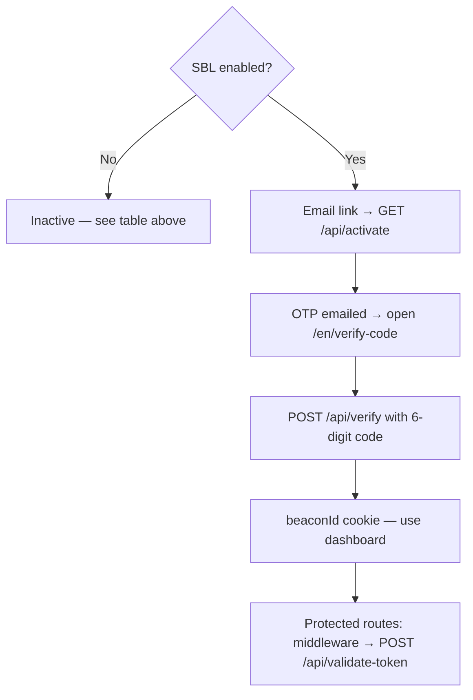

# Secure Beta Access (SBL)

Magic link → email **OTP** → **`beaconId`** cookie → **middleware** checks the session with the beta service on each page load. **Off** unless **`MHPD_SECURE_BETA_ENABLED`** is exactly **`'true'`** and **`MHPD_BETA_ACCESS_SERVICE`** points at the beta API (see **Environment**).

## SBL off vs on

|                                       | **Inactive** (env ≠ `'true'`)  | **Active**                                                                                                     |
| ------------------------------------- | ------------------------------ | -------------------------------------------------------------------------------------------------------------- |
| Middleware (matcher hits)             | `next()` — no cookie check     | Enforces **`beaconId`** except on excluded paths                                                               |
| `/api/activate`, `/verify`, `/resend` | Redirect / JSON toward **`/`** | Full beta integration                                                                                          |
| **`/en/verify-code`** page            | GSSP → redirect **`/`**        | Shown when `linkId` present (English only; **`/verify-code`** / **`/cy/verify-code`** → **`/en/verify-code`**) |

When **active**, a bad or missing service URL breaks activate / verify / resend / validation and users often see **`/en/link-access-error`**.

## Flow diagram

Single straight line for the **active** happy path (no crossing edges). **Inactive** is the other branch from the same first question.

**When SBL is active:** middleware only runs on its **matcher** (not **`_next`**, **`/api`**, **`/.netlify`**). It **skips** token checks for **`/en/verify-code`**, **`/en/link-access-error`**, **`/cy/link-access-error`**, and **static asset** URLs (see **`middleware.ts`**). **Failures:** bad link / send / token → **`/en/link-access-error`**; wrong OTP → user stays on **`/en/verify-code`** with an API error (can **resend**).

## Active flow (short)

1. Open magic link → activate checks link with beta, sends code → **`/en/verify-code`**.
2. Enter OTP → **POST /api/verify** → sets **`beaconId`** (90 days) → redirect home.
3. Further navigations: middleware calls **`/api/validate-token`** (which calls beta **`GET /validate`** with **`token`** header) unless the path is excluded or SBL is off.

**Resend:** **`GET /api/resend?linkId=…`** from the verify page.

## App routes

| Route                 | Method | Role                                                                             |
| --------------------- | ------ | -------------------------------------------------------------------------------- |
| `/api/activate`       | GET    | Link check + send-code → **`/en/verify-code`** (or errors / rate-limit redirect) |
| `/api/verify`         | POST   | Verify OTP → set cookie on success                                               |
| `/api/resend`         | GET    | New OTP                                                                          |
| `/api/validate-token` | POST   | `{ token }` — middleware → beta validate                                         |

## Beta service (base URL = env)

| Call                                 | Purpose                                    |
| ------------------------------------ | ------------------------------------------ |
| `GET /send-code?linkId=…`            | Email OTP                                  |
| `GET /verify-code?linkId=…`          | Link check (activate); `responseCode` only |
| `GET /verify-code?linkId=…&code=…`   | Full verify; token on success              |
| `GET /validate` + header **`token`** | Session still valid                        |

No **`/api`** prefix on these paths in our client.

## Environment

| Variable                   | Meaning                |
| -------------------------- | ---------------------- |
| `MHPD_SECURE_BETA_ENABLED` | `'true'` to enable SBL |
| `MHPD_BETA_ACCESS_SERVICE` | Beta API base URL      |

## Pages & cookie

- **`/en/verify-code`** — OTP form (`linkId` required); copy is always English (`useTranslation('en')`).
- **`/en/link-access-error`** — Bad link, missing session, or failed validation.
- **`beaconId`** — httpOnly token; re-checked via **`/validate`**.

**Deploy note:** **`validate-token.mts`** on Netlify mirrors **`pages/api/validate-token`** used with **`next dev`**.

## UX (high level)

- OTP mistakes / expiry / rate limit → verify page messages from **`/api/verify`**.
- Broken link or bad session → **`/en/link-access-error`**.
